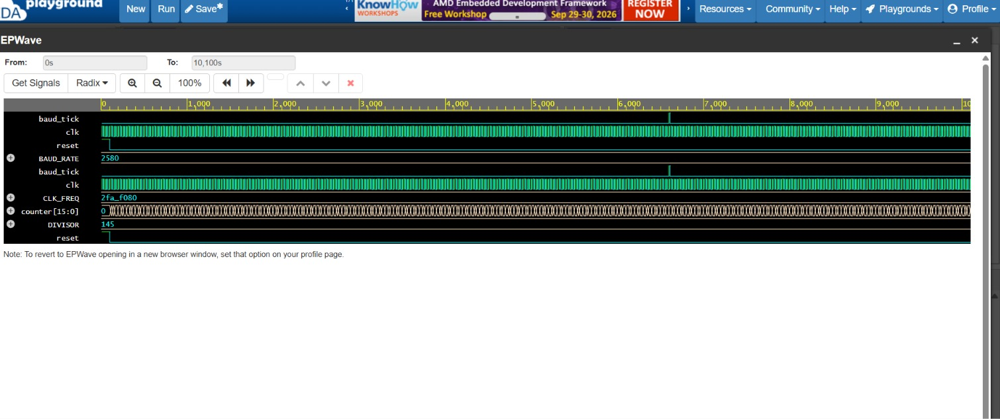

# UART Controller with Self-Checking Testbench

A synthesizable Verilog implementation of a Universal Asynchronous Receiver-Transmitter (UART) Controller featuring 16x oversampling logic for reliable serial data transmission and reception.

## Key Features
- **Baud Rate Generator:** Configurable clock divider generating precision baud pulses (9600 bps from a 50 MHz input clock).
- **Transmitter (TX):** Finite State Machine (FSM) converting 8-bit parallel data into frame-based serial transmission.
- **Receiver (RX):** FSM with 16x oversampling logic to detect start bits and sample data at bit midpoints.
- **Verification:** SystemVerilog self-checking testbench in loopback configuration with automated PASS/FAIL assertions.

## Directory Structure
- `design.sv`: Verilog modules for Baud Rate Generator, TX, RX, and Top Loopback Wrapper.
- `testbench.sv`: SystemVerilog verification suite with automated task assertions.
- `waveform.png`: EPWave timing diagram showing signal transitions.

## Verification & Waveform Results



```text
[PASS] Sent: 0x35 | Received: 0x35 at time 988110 ns
--- SUCCESS: All Bytes Transmitted & Received Successfully ---
## How to Run Simulation

1. Open [EDA Playground](https://www.edaplayground.com/).
2. Copy `design.sv` into the **Design** window and `testbench.sv` into the **Testbench** window.
3. Select **Icarus Verilog 11.0** as the simulator in the left panel.
4. Check the **Open EPWave after run** box.
5. Click **Run** to execute the testbench and view the waveform output.
